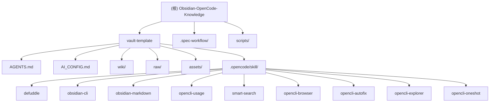

# Obsidian-OpenCode-Knowledge

> 面向非技术用户的本地 AI 知识管理方案。无需编程，一键部署，开箱即用。

## 项目愿景

让每个人都能在本地电脑上記筆記、管理知識，AI 幫你自動整理、查詢、校對。核心組件：Obsidian（筆記軟體）+ OpenCode（AI 助手）+ 知識庫規則（AGENTS.md）。

## 架构总览

```
┌─────────────────────────────────────────────────────────┐
│  ┌─────────────┐    ┌─────────────┐    ┌─────────────┐ │
│  │   Obsidian  │◄──►│  OpenCode   │◄──►│  知识库规则 │ │
│  │  (笔记软件)  │    │  (AI 助手)  │    │ (AGENTS.md) │ │
│  └─────────────┘    └─────────────┘    └─────────────┘ │
└─────────────────────────────────────────────────────────┘
```

## ✨ 模块结构图



## 模块索引

| 模块路径 | 职责 | 入口文件 | 测试目录 | 配置文件 |
|---------|------|---------|---------|---------|
| vault-template/ | Obsidian vault 模板，AI 知识库核心结构 | AGENTS.md, AI_CONFIG.md | - | AI_CONFIG.md |
| .spec-workflow/ | 规格工作流模板（design/requirements/product/tasks/structure/tech） | templates/*.md | - | - |
| scripts/ | 部署与诊断脚本（macOS + Windows） | setup.sh / setup.ps1 | - | - |
| vault-template/.opencode/skill/defuddle/ | 网页内容提取（去除杂物，保留 Markdown） | SKILL.md | - | - |
| vault-template/.opencode/skill/obsidian-cli/ | Obsidian CLI 操作（读/创/搜/管笔记） | SKILL.md | - | - |
| vault-template/.opencode/skill/obsidian-markdown/ | Obsidian Flavored Markdown 语法 | SKILL.md | - | - |
| vault-template/.opencode/skill/opencli-usage/ | OpenCLI 命令参考（87+ 适配器） | SKILL.md | - | - |
| vault-template/.opencode/skill/smart-search/ | 智能搜索路由器（多平台路由） | SKILL.md | - | - |
| vault-template/.opencode/skill/opencli-browser/ | 浏览器自动化（Chrome 操控） | SKILL.md | - | - |
| vault-template/.opencode/skill/opencli-autofix/ | 适配器自动修复 | SKILL.md | - | - |
| vault-template/.opencode/skill/opencli-explorer/ | 适配器探索式开发指南 | SKILL.md | - | - |
| vault-template/.opencode/skill/opencli-oneshot/ | 单点快速 CLI 生成 | SKILL.md | - | - |

## 运行与开发

### 快速部署

```bash
# 克隆仓库
git clone https://github.com/fcmyoo/Obsidian-OpenCode-Knowledge.git
cd Obsidian-OpenCode-Knowledge

# 运行部署脚本
bash setup.sh
```

### 知识库目录结构

```
我的知识库/
├── AGENTS.md               # AI 规则（由系统维护）
├── AI_CONFIG.md            # AI 配置文件（用户可自定义）
├── raw/                   # 原始素材（AI 只读）
│   └── social/            # 社交媒体原始内容（按知识域分类）
├── wiki/                  # AI 维护的消化笔记
│   ├── index.md           # 全局索引
│   └── log.md             # 操作日志
├── assets/                # 配图资源
└── .opencode/skill/       # AI 技能（9个）
```

## 测试策略

本项目包含针对 Project KB 的自动化回归测试，以及面向部署流程的诊断脚本。主要质量保障：
- `tests/test_project_kb.py` - Project KB CLI / MCP / adapter / export / view / validation 回归测试
- `scripts/opencode-obsidian-doctor.sh` - macOS 部署诊断
- `scripts/opencode-obsidian-doctor.ps1` - Windows 部署诊断
- 手动验证：部署后在 Obsidian 中测试 AI 对话

## 编码规范

- 所有文档使用 UTF-8 编码
- Markdown 文件遵循 Obsidian Flavored Markdown 规范
- YAML 配置使用标准格式
- Bash 脚本兼容 macOS

## Project KB

- For architecture, historical decisions, module boundaries, long-running tasks, and known pitfalls, use the `project-kb` workflow through the Project KB CLI or MCP facade.
- Resolve the current repository with `python scripts/kb.py project-find --repo <repo-path>` before wider research.
- Read `Projects/<Project>/hot.md` when continuing long-running work.
- Treat current code, tests, and checked-in docs as implementation truth when Obsidian notes conflict.
- Append task logs only after verification, and never use Project KB to delete or overwrite full notes.

## AI 使用指引

### 四个核心触发行为

1. **Ingest（录入素材）**: "加到 wiki"、"ingest 这个"、"把这个收进来"
2. **Query（查询）**: "我知道啥关于 X"、"wiki 里有没有 Y"
3. **Lint（体检）**: "lint wiki"、"体检"、"wiki 有啥问题"
4. **Social Ingest（社交媒体录入）**: "爬了这个"、"收录这条"

### 知识域分类

| 知识域 | 涵盖内容 |
|--------|----------|
| 消费研究 | 探店、测评、好物推荐、价格对比 |
| 技能方法 | 教程、攻略、方法论、经验分享 |
| 行业洞察 | 趋势分析、商业观察、行业报告 |
| 生活方式 | 旅行、美食、穿搭、家居、健康 |
| 观点思考 | 深度评论、思考、价值观输出 |
| 创意灵感 | 设计、文案、营销案例、内容创作 |
| 资源收藏 | 工具推荐、书单、课程、资源清单 |

## 变更记录 (Changelog)

- **2026-04-22**: 初始化项目 AI 上下文，生成模块结构图和文档
